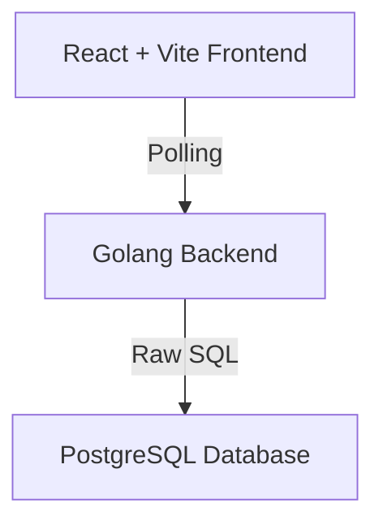

# Design Decisions

## Overview
This document outlines the architecture, key design decisions, trade-offs, and areas for future improvement in the project It explains technology choices and highlights opportunities for enhancement with additional time

---

## Architecture Diagram

---

## Technology Stack

- **Backend:** Go (Golang)
- **Frontend:** React with Vite
- **Database:** PostgreSQL
- **Database Access:** Raw SQL queries
- **Frontend Data Flow:** Polling (HTTP requests)

---

## Design Decisions & Trade-offs

### PostgreSQL
- **Why:** Reliable, ACID-compliant, strong relational support
- **Trade-off:** Manual SQL queries require careful maintenance and are error-prone compared to ORMs

### React + Vite
- **Why:** Fast development, lightweight tooling, rapid HMR
- **Trade-off:** Smaller plugin ecosystem than CRA, but faster builds

### Polling for Data Updates
- **Why:** Simple to implement and scale for small apps
- **Trade-off:** Increased network requests and latency versus SSE/WebSockets

### Raw SQL Queries
- **Why:** Flexibility and performance tuning
- **Trade-off:** Higher risk of SQL injection and more boilerplate

### Golang Backend
- **Why:** Performance, concurrency, type safety
- **Trade-off:** More boilerplate for tasks like JSON marshaling and validation

---

## Potential Improvements

### User Management
- Add robust RBAC (role-based access control), user roles, permissions, and auditing
- **Benefit:** Security, accountability, and flexible multi-user workflows

### User-Based Package Processing
- Restrict package processing by user roles or assignments
- **Benefit:** Organized workflow and improved accountability

### Frontend Enhancements
- Modular UI components, improved state management (React Query/Zustand)
- Real-time updates via WebSocket/SSE for critical workflows

### Security Improvements
- Implement input validation, secure authentication (OAuth2/JWT), and regular dependency audits
- **Benefit:** Reduces vulnerabilities and strengthens overall system security

### CI/CD with GitHub Actions
- Automate build, test, and deployment pipelines using GitHub Actions
- **Benefit:** Faster, more reliable releases and improved developer productivity

### Centralized Logging with Loki
- Integrate Loki for centralized log aggregation and monitoring
- **Benefit:** Easier debugging, better observability, and faster incident response

---

